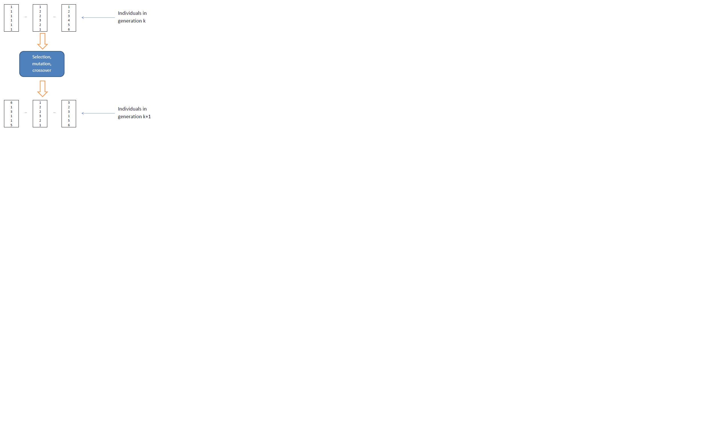

## Problem definition

In a stratified sampling design with one or more stages, a sample is selected from a frame containing the units of the population of interest, stratified according to the values of one or more auxiliary variables (X) available for all units in the population.

For a given stratification, the overall size of the sample and the allocation in the different strata can be determined on the basis of constraints placed on the expected accuracy of the various estimates regarding the survey variables (Y).

If the target survey variables are more than one the optimization problem is said to be **multivariate**; otherwise it is **univariate**.

For a given stratification, in the multivariate case the optimization of the allocation is in general based on the **Neyman allocation**. In the univariate case it is possible to make use of the **Bethel algorithm**.

## Problem definition 

The criteria according to which stratification is defined are crucial for the efficiency of the sample.

With the same precision constraints, the overall size of the sample required to satisfy them may be significantly affected by the particular stratification chosen for the population of interest.

## Optimal allocation for a given stratification {.smaller}

Given G survey variables, their sampling variance is:

$$Var(\hat{Y_{g}})=\sum_{h=1}^{H}N_{h}^{2} (1- \frac{ 
  n_{h}}
  {N_{h}}) \frac{ 
  S_{h,g}^{2}}
  {n_{h}} \;\;\;  g=1,...,G$$ 

If we introduce the following cost function:

$$C(n_{1},...,n_{H})=C_{0}+\sum_{h=1}^{H}C_{h}n_{h} $$

## Optimal allocation for a given stratification {.smaller}

the optimization problem can be formalized in this way:

$$min= C_{0}+\sum_{h=1}^{H}C_{h}n_{h}\\ $$
under the constraints
$$ 
\begin{cases} 
CV(\hat{Y_{1}}) < U_{1}\\ 
CV(\hat{Y_{2}}) < U_{2}\\
...\\
CV(\hat{Y_{G}}) < U_{G}\\
\end{cases}
$$
where
$$ CV(\hat{Y_{g}}) = \frac{\sqrt{Var(\hat{Y_{g}})} } {mean(\hat{Y_{g}})}$$

## The universe of stratifications {.smaller}

Given a population frame with m auxiliary variables 
$X_{1},..., X_{M}$ 
we define as **atomic stratification** 
the one that can be obtained considering the cartesian product of the definition domains of the m variables.
$$L=\{(l_{1}),(l_{2}),...,(l_{k})\}$$
Starting from the atomic stratification, it is possible to generate all the different stratifications that belong to the universe of stratifications. For example:

$$
\begin{align*}
&P_{1}=\{(l_{1},l_{2},l_{3})\} & P_{2}=\{(l_{1}),(l_{2},l_{3})\} \\
&P_{2}=\{(l_{2}),(l_{1},l_{3})\} & P_{4}=\{(l_{31}),(l_{1},l_{2})\} \\
&P_{5}=\{(l_{1}),(l_{2}),(l_{k})\}
\end{align*}
$$

The number of feasible stratifications  is exponential with respect to the number of initial atomic strata:

$$
\begin{align*}
& B_{4}=15 & B_{10}=115975 &
& B_{100}\approx 4.76 \times 10^{115} 
\end{align*}
$$
In concrete cases, it is therefore impossible to examine all the different possible alternative stratifications. 
The **Genetic Algorithm** allows to explore the universe of stratification in a very efficient way in order to find the optimal (or close to optimal) solution.

## Use of the Genetic Algorithm in the optimization process

In planning a strafied sampling for a given survey, proceed as follows:

> - given the survey variables $Y_{1},Y_{2},...,Y_{p}$, set **precision constraints** on their estimates in the different domains, expressed in terms of CVs (coefficients of variation);

> - in the available sampling frame build the **atomic stratification**, obtained as cartesian product of the domains of the auxiliary variables $X_{1},...,X_{M}$;

## Use of the genetic algorithm in the optimization process

> - in each atomic stratum report the distributional characteristics of the survey variables by calculating their **means** and **standard deviations** calculate the values of the population (directly or by using proxy variables);

> - on the basis of these inputs, the Genetic Algorithm determines the **best solution** in terms of both frame **stratification**, **sample size** and **allocation** in optimized strata.

## Use of the genetic algorithm in the optimization process

```{r, out.width = "2000px", echo = FALSE}
knitr::include_graphics("figures/Image1.png")
```


## Use of the genetic algorithm in the optimization process

The application of the genetic algorithm is based on the following steps:

> - a given stratification is considered as an _individual_ in a population (= _generation_) subject to _evolution_;

> - each individual is characterized by a _genome_ represented by a vector of dimension equal to the number of atomic strata: the position of each element is  univocally associated to an atomic stratum;

> - each element in the vector is assigned a random value between 1 and K (maximum acceptable number of  strata): the vector therefore indicates the way in which the individual atomic strata are aggregated together;


## Use of the genetic algorithm in the optimization process

```{r, out.width = "2200px", echo = FALSE}

```


## Use of the genetic algorithm in the optimization process

> - for each individual (stratification) its _fitness_ is calculated by solving the corresponding problem of optimal allocation by means of Bethel's algorithm;

> - in passing from one generation to the next, _individuals with higher fitness are favored_;

> - at the end of the process of evolution, **_the individual with the overall best fitness represents the optimal solution_**.

