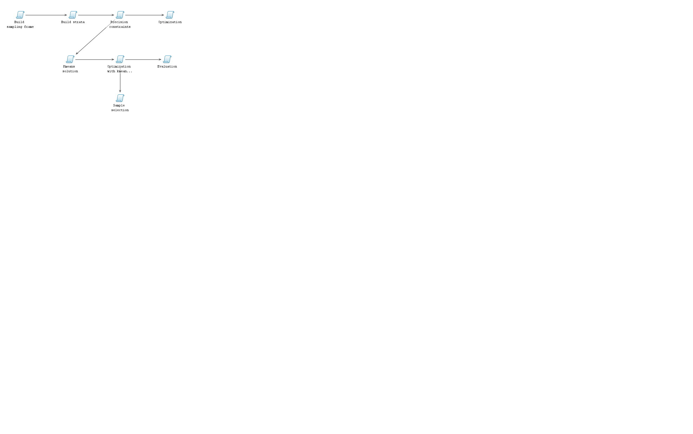
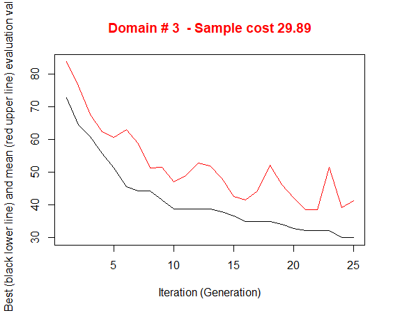
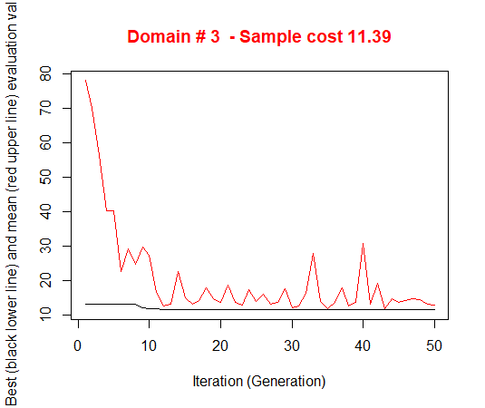

```{r, include = F}
library(SamplingStrata)
data("swissmunicipalities")
data("swisserrors")
data("swissframe")
data("swissstrata")
# load("2. SamplingStrata functions.RData")
```

## Procedural steps (basic implementation)

The optimization of the sampling design starts by making the **sampling frame** available, defining the **target estimates** of the survey and establishing the precision constraints on them. 

It is then possible to determine the **best stratification** and the **optimal allocation**. 

Finally, we proceed with the **selection of the sample**. 

It is also possible to evaluate the **expected CVs** for each target survey variable.


## Procedural steps (basic implementation){.smaller}


> - definition of the **sampling frame** data: identification of available auxiliary information, of the survey variables and of domains of interest;
> - **manipulation of auxiliary information**: in case auxiliary variables are of the continuous type, they must be transformed into a categorical form;
> - **construction of atomic strata**: on the basis of the categorical auxiliary variables available in the sampling frame, a set of strata can be constructed by calculating the Cartesian product of the values of all the auxiliary variables;
> - characterization of each atomic stratum with the information related to the target variables: in order to optimise both strata and allocation of sampling units in strata, we need information on the distributions of the target variables (means and standard deviations) inside the different strata;
> - choice of the precision constraints for each target estimate, possibly differentiated by domain;
> - **optimization** of stratification and determination of required sample size and allocation in order to satisfy precision constraints on target estimates;
> - analysis of the resulting optimized strata;
> - association of **labels to sampling frame** units, each of them indicating the  strata resulting by the **optimization** step;
> - **selection of units** from the sampling frame;
> - evaluation of the found optimal solution in terms of **expected precision and bias**.

## Procedural steps (basic implementation)

```{r, out.width = "5000px", echo = FALSE}

```

## Definition of the sampling frame data

As a first step, we have to define a frame dataframe containing the following information:

> - a unique identifier of the unit ('id');
> - the values of m auxiliary variables (named from X1 to Xm);
> - the values of p target variables (named from Y1 to Yp);
> - the value of the domain of interest for which we want to produce estimates (named 'domainvalue').

## Definition of the sampling frame data {.smaller}

```{r, eval = T}
library(SamplingStrata)
data(swissmunicipalities)
# Only three regions
swissmunicipalities <- swissmunicipalities[swissmunicipalities$REG < 4,]
```


we get the swissmunicipalities dataframe, that contains 2896 observations (each observation refers to a Swiss municipality). For reasons of processing time, here we consider only the first two regions.
Among the others, there are the following variables (data are referred to 2003):

* REG: Swiss region
* Nom: municipality name
* Surfacesbois: wood area
* Surfacescult: area under cultivation
* Alp: mountain pasture area
* Airbat: area with buildings
* Airind: industrial area
* Pop020: number of men and women aged between 0 and 19
* Pop2040: number of men and women aged between 20 and 39
* Pop4065: number of men and women aged between 40 and 64
* Pop65P: number of men and women aged between 65 and over
* POPTOT: total population

## Definition of the sampling frame data {.smaller}

Let us suppose we want to plan a survey whose target estimates are the totals of population by age class in each Swiss region. In this case, our Y variables will be:

* Y1: number of men and women aged between 0 and 19
* Y2: number of men and women aged between 20 and 39
* Y3: number of men and women aged between 40 and 64
* Y4: number of men and women aged between 65 and over

As for the auxiliary variables (X's), we can use all of those characterising the area use (wood, mountain or pasture, cultivated, industrial, with buildings).

Finally, we want to produce estimates not only for the whole country, but also for each one of the seven different regions.

## Function 'buildFrameDF' 

Function **buildFrameDF** permits to organize data of the sampling frame in a suitable mode for the process:

```{r, eval = T}
swissmunicipalities$id <- c(1:nrow(swissmunicipalities))
swissframe <- buildFrameDF(df = swissmunicipalities,
                           id = "id",
                           X = c("POPTOT",
                                 "Surfacesbois",
                                 "Surfacescult",
                                 "Alp",
                                 "Airbat",
                                 "Airind"),
                           Y = c("Pop020",
                                 "Pop2040",
                                 "Pop4065",
                                 "Pop65P"),
                           domainvalue = "REG")
```

## Function 'var.bin'

As the X variables are of the continuous type, first we have to reduce them in a categorical (ordinal) form.
A suitable way to do so, is to apply a k-means clustering method, by using the **var.bin** function:

```{r, eval = T}
swissframe$X1 <- var.bin(swissmunicipalities$POPTOT, bins=18)
swissframe$X2 <- var.bin(swissmunicipalities$Surfacesbois, bins=3)
swissframe$X3 <- var.bin(swissmunicipalities$Surfacescult, bins=3)
swissframe$X4 <- var.bin(swissmunicipalities$Alp, bins=3)
swissframe$X5 <- var.bin(swissmunicipalities$Airbat, bins=3)
swissframe$X6 <- var.bin(swissmunicipalities$Airind, bins=3)
```

## Function 'buildFrameDF '

We could also not indicate substantive X variables, if we want that each unit in the sampling frame be considered as an atomic stratum, and let to the optimization step to aggregate them on the basis of the values of the Y variable. In any case, as we have to indicate at least one X variable, we can use to this purpose the unique identifier in the frame:

```{r, eval = T}
swissmunicipalities$id <- c(1:nrow(swissframe))
newframe <- buildFrameDF(df = swissmunicipalities,
                         id = "id",
                         X = "id",
                         Y = c("Pop020",
                               "Pop2040",
                               "Pop4065",
                               "Pop65P"),
                         domainvalue = "REG")
```

## Function 'buildStrataDF' {.smaller}

The *strata* dataframe reports information regarding each atomic stratum in the population. There is one row for each stratum. 
The total number of strata is given by the number of different combinations of X's values in the frame. 
For each stratum, the following information is required:

*	the identifier of the stratum (named 'stratum'), concatenation of the values of the X variables;
*	the values of the m auxiliary variables (named from X1 to Xm) corresponding to those in the frame;
*	the total number of units in the population (named 'N');
*	a flag (named 'cens') indicating if the stratum is to be censused (=1) or sampled (=0);
*	a variable indicating the cost of interviewing per unit in the stratum (named 'cost');
*	for each target variable y, its mean and standard deviation, named respectively 'Mi' and 'Si');
*	the value of the domain of interest to which the stratum belongs ('DOM1').

## Function 'buildStrataDF'

It is possible to automatically generate the strata dataframe by invoking the **buildStrataDF** function. 

Let us consider again the swissframe dataframe that we have built in previous steps. On this frame we can apply the function buildStrataDF:

```{r, eval=T}
swissstrata <- buildStrataDF(swissframe, progress = FALSE)
```

## Function 'buildStrataDF'

It is worth while noting that the total number of different atomic strata is 641, lower than the dimension of the Cartesian  product of the X's (which is 4374): this is due to the fact that not all combinations of the value of the auxiliary variables are present in the sampling frame.

Variables 'cost' and 'cens' are initialised respectively to 1 and 0 for all strata. It is possible to give them different values:

*	for variable 'cost', it is possible to differentiate the cost of interviewing per unit by assigning real values;
*	for variable 'cens', it is possible to set it equal to 1 for all strata that are of the 'take-all' type (i.e. all units in that strata must be selected).


## Choice of the precision constraints for each target estimate

The errors dataframe contains the accuracy constraints that are set on target estimates. 

This means to define a maximum coefficient of variation for each variable and for each domain value. 

Each row of this frame is related to accuracy constraints in a particular subdomain of interest, identified by the **domainvalue** value. 

## Choice of the precision constraints for each target estimate

In the case of the Swiss municipalities, we have chosen to define the following constraints:

```{r, eval=TRUE, echo=TRUE}
swisserrors <- as.data.frame(list(DOM=rep("DOM1",3),
                         CV1=rep(0.08,3),
                         CV2=rep(0.12,3),
                         CV3=rep(0.08,3),
                         CV4=rep(0.12,3),
                         domainvalue=c(1:3)
))
swisserrors
```

## Function 'checkInput' {.smaller}

Once having defined dataframes containing frame data, strata information and precision constraints, it is worth while to check their internal and reciprocal coherence. 

It is possible to do that by using the function **checkInput**:

```{r, eval=TRUE, echo=TRUE}
checkInput(errors = swisserrors, 
           strata = swissstrata, 
           sampframe = swissframe)
```

This function controls that 

* the number of auxiliary variables is the same in the frame and in the strata dataframes; 
* the number of target variables indicated in the frame dataframe is the same than the number of means and standard deviations in the strata dataframe, 
* the number of target variables is the same than the number of coefficient of variations indicated in the errors dataframe.

## Function 'bethel'

If we try to determine the total size of the sample required to satisfy these precision constraints, considering the current stratification of the frame (the 641 atomic strata), we can do it by simply using the function **bethel**. This function requires a slightly different specification of the constraints dataframe:

```{r, eval=TRUE, echo=TRUE}
cv <- swisserrors[1,]
cv
```

because the **bethel** function does not permit to differentiate precision constraints by subdomain. 

## Function 'bethel'

The result of the application of the Bethel algorithm is:

```{r, eval=TRUE,echo=TRUE}
allocation <- bethel(swissstrata,cv,printa=T)
sum(allocation)
attributes(allocation)$outcv
```
That is, the required amount of units to be selected, with no optimization of sampling strata. 

In general, after the optimization, this number is sensibly reduced.

## Function 'optimizeStrata' {.smaller}

Once the strata and the constraints dataframes have been prepared, it is possible to apply the function that optimises the stratification of the frame, that is optimizeStrata. This function operates on all subdomains, identifying the best solution for each one of them. The fundamental parameters to be passed to optimizeStrata are:

> - **errors**: the (mandatory) dataframe containing the precision levels expressed in terms of maximum allowable coefficients of variation that regard the estimates on target variables of the survey
> - **strata**: the (mandatory) dataframe containing the information related to 'atomic' strata, i.e. the strata obtained by the Cartesian product of all auxiliary variables X's 
> - **cens**: the (optional) dataframe containing the 'take-all' strata, those strata whose units must be selected in whatever sample. It has same structure than *strata} dataframe
> - **strcens**: flag (TRUE/FALSE) to indicate if 'take-all' strata do exist or not. Default is FALSE
> - **initialStrata**: the initial limit on the number of strata for each solution. Default is NA, and in this case it is set equal to the number of atomic strata in each domain. If the parameter addStrataFactor is equal to zero, then initialStrata is equivalent to the maximum number of strata to be obtained in the final solution
> - **addStrataFactor**: indicates the probability that at each mutation the number of strata may increase with respect to the current value. Default is 0.0


## Function 'optimizeStrata' {.smaller}


> - **minnumstr**: indicates the minimum number of units that must be allocated in each stratum. Default is 2
iter: indicates the maximum number of iterations (= generations) of the genetic algorithm. Default is 50
> - **pops**: dimension of each generations in terms of number of individuals to be generated. Default is 20
> - **mut_chance** (mutation chance): for each new individual, the probability to change each single chromosome, i.e. one bit of the solution vector. High values of this parameter allow a deeper exploration of the solution space, but a slower convergence, while low values permit a faster convergence, but the final solution can be distant from the optimal one. Default is NA, in correspondence of which it is computed as 1/(vars+1) where vars is the length of elements in the solution
> - **elitism_rate**: indicates the rate of better solutions that must be preserved from one generation to another. Default is 0.2
> - **suggestions**: indicates one possible solution (from kmeans clustering or from previous runs) that will be introduced in the initial population. Default is NULL
> - **realAllocation** : if FALSE, the allocation is based on INTEGER values; if TRUE, the allocation is based on REAL values. Default is FALSE.
> - **writeFiles** : it indicates if the various dataframes and plots produced during the execution have to be written in the working directory. Default is FALSE

## Function 'optimizeStrata' {.smaller}

```{r, eval = T }
solution <- optimizeStrata(
	errors = swisserrors, 
	strata = swissstrata,
	iter = 25,
	pops = 10,
	writeFiles = TRUE,
	showPlot = FALSE,
	parallel = FALSE)
sum(ceiling(solution$aggr_strata$SOLUZ))
```

```{r, eval=T, echo = FALSE}
sum(ceiling(solution$aggr_strata$SOLUZ))
```
```{r, out.width = "1000px", echo = FALSE}

```

## Function 'KmeansSolution' {.smaller}

In order to speed up the convergence towards the optimal solution, an initial one can be given as a "suggestion" to 'optimizeStrata' function. The function KmeansSolution produces this initial solution by clustering atomic strata considering the values of the means of all the target variables Y.

Also, the optimal number of clusters is determined inside each domain. If the default value for nstrata is used, then the number of aggregate strata is optimized by varying the number of cluster from 2 to number of atomic strata in each domain, divided by 2. Otherwise, it is possible to indicate a fixed number of aggregate strata to be obtained.

Other parameters are: 

*	*minnumstrat*: the minimum number of units to be allocated in each stratum(default is 2);
*	*maxcluster*: the maximum number of clusters to be considered in the execution of kmeans algorithm;
*	*showPlot*: if TRUE, allows to visualise the optimization.

For any given number of clusters, the correspondent aggregation of atomic 
strata is considered as input to the function 'bethel'. The number of clusters
for which the value of the sample size necessary to fulfil precision constraints
is the minimum one, is retained as the optimal one.

## Function 'KmeansSolution' {.smaller}

The overall solution is obtained by concatenating optimal clusters obtained in domains. The result is a dataframe with two columns: the first indicates the clusters, the second the domains:

```{r, eval=TRUE, echo=TRUE, warning=FALSE}
solutionKmeans <- KmeansSolution(swissstrata,
                                   swisserrors,
                                   nstrata=NA,
                                   minnumstrat=2,
                                   maxclusters=NA,
                                   showPlot=FALSE)
```

## Function 'KmeansSolution' {.smaller}


```{r, eval=TRUE, echo=TRUE, warning=FALSE}
head(solutionKmeans)
```

```{r, out.width = "1000px", echo = FALSE}
knitr::include_graphics("images1/Rplot_kmeans.png",dpi=NA)
```


## Optimization with kmeans solution as initial suggestion {.smaller}

```{r, eval=T, }
solution_with_kmeans <- optimizeStrata(
	errors = swisserrors,
	strata = swissstrata,
	iter = 25,
	pops = 10,
	suggestions = solutionKmeans,
	writeFiles = TRUE,
	showPlot = FALSE,
	parallel = FALSE)
sum(ceiling(solution_with_kmeans$aggr_strata$SOLUZ))
```

```{r, eval=T , echo = FALSE}
sum(ceiling(solution_with_kmeans$aggr_strata$SOLUZ))
```
```{r, out.width = "300px", echo = FALSE}

```


## Function 'adjustSize' {.smaller}

After the optimization step, the final sample size is the result of the allocation of units in final strata. This allocation is such that the precision constraints are expected to be satisfied. Actually, three possible situations may occur:

1. the resulting sample size is acceptable;
2. the resulting sample size is to high, it is not affordable with respect to the available budget;
3. the resulting sample size is too low, the available budget permits to increase the number of units.

In the first case, no action is required. In the second case, it is necessary to reduce the number of units, by equally applying the same reduction rate in each stratum. In the third case, we could either to set more tight precision constraints, or proceed to increase the sample size by applying the same increase rate in each stratum. This increase/reduction process is iterative, as by applying the same rate we could find that in some strata there are not enough units to increase or to reduce. 

## Function 'adjustSize' {.smaller}

The function *adjustSize* permits to obtain the desired final sample size.
Let us suppose that the obtained sample size is not affordable. 

We can reduce it by executing the following code:

```{r, eval=TRUE, echo=TRUE}
adjustedStrata <- adjustSize(size=30,
                             strata=solution_with_kmeans$aggr_strata,cens=NULL)
sum(adjustedStrata$SOLUZ)
```

## Function 'adjustSize' {.smaller}

Instead, if we want to increase the size because the budget allows to do this, then this is the code:

```{r, eval=TRUE, echo=TRUE}
adjustedStrata <- adjustSize(size=60,
                             strata=solution_with_kmeans$aggr_strata,cens=NULL)
sum(adjustedStrata$SOLUZ)
```

## Function 'adjustSize' {.smaller}

The difference between the desired sample size and the actual adjusted size depends on the number of strata in the optimized solution. Consider that the adjustment is performed in each stratum by taking into account the relative difference between the current sample size and the desired one: this produces an allocation that is expressed by a real number, that must be rounded. 

The higher the number of strata, the higher the impact of the rounding in all strata on the final adjusted sample size.

## Function 'updateStrata' {.smaller}

This function has two purposes:

1. instrumental to the processing of the sampling frame (attribution of the labels of the optimized strata to the population units);
2. analysis of the aggregation of the atomic strata obtained in the optimized solution.

The function **updateStrata** assigns the labels of the new strata to the initial one in the dataframe *strata*, and produces:

* a new dataframe named *newstrata* containing all the information in the *strata* dataframe, plus the labels of the new optimized strata;
* a table, contained in the dataset *strata_aggregation.txt*, showing in which way each optimized stratum aggregates the auxiliary variables X's.

## Function 'updateStrata' {.smaller}

The function is invoked in this way:

```{r, eval=TRUE, echo=TRUE}
newstrata <- updateStrata(swissstrata, 
                          solution_with_kmeans, 
                          writeFiles = TRUE)
head(newstrata,3)
```

## Function 'updateStrata' {.smaller}

Now, the atomic strata are associated to the aggregate strata defined in the optimal solution, by means of the variable *LABEL*. If we want to analyse in detail the new structure of the stratification, we can look at the *strata_aggregation.txt* 
file:

```{r, eval=TRUE, echo=TRUE}
strata_aggregation <- read.delim("strata_aggregation.txt")
head(strata_aggregation)
```

In this structure, for each aggregate stratum the values of the X's variables in each contributing atomic stratum 
are reported. It is then possible to understand the meaning of each aggregate stratum produced by the optimization.

## Function 'updateFrame' {.smaller}

To update the frame units with new stratum labels (combination of the new values of the auxiliary variables X's), we mke use of the **updateFrame** function:

```{r, eval=TRUE, echo=TRUE}
framenew <- updateFrame(swissframe, 
                        newstrata, 
                        writeFiles=FALSE)
``` 
The execution of this function produces a dataframe framenew, and also a file (named framenew.txt) with the labels of the new strata produced by the optimization step. 

## Function 'selectSample' {.smaller}

Once the sampling frame has been added the indication of the optimized aggregated strata (variable *LABEL* in *framenew* dataframe), it is possible to select the desired sample.
The allocation vector (i.e. the number of units to be selected in each stratum) is contained in variable *SOLUZ* in the *solution$aggr_strata* element of the list *solution* (or in the list which is the result of the adjustment of the sample size).

The selection of the sample is obtained by applying the function **selectSample**:

```{r, eval=TRUE, echo=TRUE}
sample <- selectSample(framenew, 
                       solution_with_kmeans$aggr_strata, 
                       writeFiles = FALSE)
```  

## Function 'selectSample' {.smaller}

By indicating 'writeFiles = TRUE', two different .csv files are produced:

*	*sample.csv* containing the units of the frame that have been selected, together with the weight that has been calculated 
for each one of them;
*	*sample.chk.csv* containing information on the selection: for each stratum, the number of units in the population, 
the planned sample, the number of selected units, the sum of their weights that must equalise the number of units in the population.

## Function 'evalSolution' {.smaller}

In order to be confident about the quality of the found solution, the function evalSolution allows to run a simulation, based on the selection of a desired number of samples from the frame to which the stratification, identified as the best, has been applied. The user can invoke this function also indicating the number of samples to be drawn:


```{r, eval=TRUE, echo=TRUE}
eval <- evalSolution(framenew, 
                     solution_with_kmeans$aggr_strata, 
                     nsampl=50, 
                     writeFiles=TRUE,
                     progress=FALSE) 
```

## Function 'evalSolution' {.smaller}

For each drawn sample, the estimates related to the Y's are calculated. Their mean and standard deviation are also computed, in order to produce the CV related to each variable in every domain. These CV's can be inspected and compared to the constraints:

```{r, eval=TRUE, echo=TRUE}
eval$coeff_var
swisserrors
```

